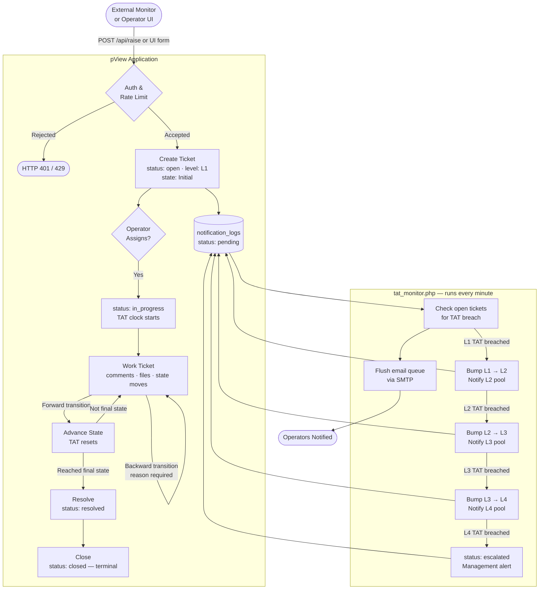
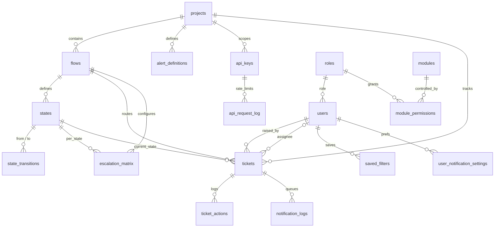

# pView Alert System

A self-hosted NOC (Network Operations Centre) alert and ticket management system built on CodeIgniter 4. It turns incoming alerts into trackable tickets, routes them through configurable multi-stage workflows, automatically escalates overdue tickets through four escalation levels, and dispatches email notifications at each lifecycle event.

---

## Table of Contents

1. [Overview](#overview)
2. [How It Works](#how-it-works)
3. [Quick Start](#quick-start)
4. [Key Features](#key-features)
5. [Technology Stack](#technology-stack)
6. [Architecture](#architecture)
7. [Folder Structure](#folder-structure)
8. [Requirements](#requirements)
9. [Installation](#installation)
10. [Database Setup](#database-setup)
11. [Configuration](#configuration)
12. [Running the Application](#running-the-application)
13. [Cron Job Setup](#cron-job-setup)
14. [User Roles & Permissions](#user-roles--permissions)
15. [Modules](#modules)
16. [Workflow Engine](#workflow-engine)
17. [Ticket Lifecycle](#ticket-lifecycle)
18. [Notifications & Email Queue](#notifications--email-queue)
19. [REST API](#rest-api)
20. [Activity Logs](#activity-logs)
21. [Settings Reference](#settings-reference)
22. [File Uploads](#file-uploads)
23. [Backup](#backup)
24. [Deployment](#deployment)
25. [Default Credentials](#default-credentials)
26. [Database Tables Reference](#database-tables-reference)

---

## Overview

pView Alert System solves the problem of alert fatigue in operations teams. When a monitoring system fires an alert, pView captures it as a structured ticket, assigns it to the right operator based on workflow rules, tracks how long it sits at each stage, and automatically escalates it if the team does not act within the configured time window.

The system is designed for use by NOC teams who need:

- A central place to receive and track alerts from multiple projects
- Clear ownership rules through workflow-defined user pools
- Automatic escalation when SLAs are missed
- A full audit trail of every action taken on every ticket
- An API for integration with external monitoring tools

---

## How It Works

### System Flow

The diagram below shows the complete lifecycle of an alert — from detection in an external monitoring system through to final closure in pView.

```
┌─────────────────────────────────────────────────────────────────────┐
│           EXTERNAL MONITORING SYSTEM                                │
│         (Zabbix, Nagios, Prometheus, custom scripts)                │
└───────────────────────────┬─────────────────────────────────────────┘
                            │  POST /api/raise   (X-API-KEY header)
                            ▼
┌─────────────────────────────────────────────────────────────────────┐
│                       pView  —  API Layer                           │
│                                                                     │
│  ① Authenticate API key  →  verify project scope                   │
│  ② Rate-limit check  (per-minute and per-hour limits)               │
│  ③ Generate unique alarm ID  →  ALM-YYYYMMDD-NNNNN                 │
│  ④ Create ticket  —  status: open  |  level: L1  |  Initial state  │
│  ⑤ Queue notification emails to Initial state L1 user pool         │
└───────────────────────────┬─────────────────────────────────────────┘
                            │
            ┌───────────────┴────────────────────┐
            │    cron fires within 1 minute       │
            ▼                                     ▼
┌──────────────────────┐            ┌─────────────────────────────────┐
│   tat_monitor.php    │            │  L1 Operators                   │
│   Sends queued       │──────────▶ │  receive email notification     │
│   emails via SMTP    │            │  Bell badge updates in browser  │
└──────────────────────┘            └─────────────────────────────────┘
```

```
OPERATOR RESPONSE
┌─────────────────────────────────────────────────────────────────────┐
│                                                                     │
│  Operator logs in  →  ticket appears in My Tickets                  │
│               ↓                                                     │
│  Assigns to self  →  status: in_progress  |  TAT clock starts      │
│               ↓                                                     │
│  Works the ticket:                                                  │
│  ├── Adds comments  (@mention colleagues → direct notification)     │
│  ├── Uploads evidence files  (log extracts, screenshots)            │
│  └── Moves state forward                                            │
│         Initial → Investigation → Fix Applied  (TAT resets each)   │
│               ↓                                                     │
│  IF TAT window is exceeded before action (cron detects):           │
│  ├── L1 TAT elapsed  →  bump to L2,  notify L2 pool                │
│  ├── L2 TAT elapsed  →  bump to L3,  notify L3 pool                │
│  ├── L3 TAT elapsed  →  bump to L4,  notify L4 pool                │
│  └── L4 TAT elapsed  →  status = escalated  (management alert)     │
│               ↓                                                     │
│  Operator resolves ticket  →  status: resolved                      │
│  Manager reviews and closes  →  status: closed  (terminal)          │
│  All further mutations rejected on closed tickets                   │
│                                                                     │
│  ━━━━━━━━━━━━━━━━━━━━━━━━━━━━━━━━━━━━━━━━━━━━━━━━━━━━━━━━━━━━━━━  │
│  Every action throughout  →  activity_logs  (append-only audit)     │
│  Every email triggered    →  notification_logs queue → cron → SMTP  │
└─────────────────────────────────────────────────────────────────────┘
```

### Project Setup Flow

The order in which an administrator configures a new project from scratch:

```
── ONE-TIME SYSTEM SETUP ────────────────────────────────────────────────
  ①  Import scripts/schema.sql          creates 22 database tables
  ②  php scripts/setup_defaults.php     seeds roles, modules, settings
  ③  Configure SMTP in Settings page
  ④  Schedule tat_monitor.php every minute  (cron / Task Scheduler)
─────────────────────────────────────────────────────────────────────────

── PER-PROJECT CONFIGURATION ────────────────────────────────────────────

  Create Project
       ↓
  Create Flow  (choose TAT level count: 1 – 4)
       ↓
  Add States to the Flow
  ┌───────────────────────────────────────────────────────────────────┐
  │  Initial state   (e.g. Triage)                                    │
  │    L1 pool: first-line operators   |   L1 TAT: 60 min             │
  │                    ↓                                              │
  │  Process states  (e.g. Investigation, Fix Applied)                │
  │    L1 – L4 pools: operators and escalation contacts per level     │
  │    L1 – L4 TAT:   time threshold in minutes before escalation    │
  │                    ↓                                              │
  │  Final state     (e.g. Resolved)                                  │
  └───────────────────────────────────────────────────────────────────┘
       ↓
  Define Transitions
  ├── Forward:   Triage → Investigation → Fix Applied → Resolved
  └── Backward:  Investigation → Triage  (rework — reason required)
       ↓
  Add Escalation Matrix overrides  (optional)
  Override TAT or notify list for any specific state + level
       ↓
  Create Alert Definitions
  Links alert_type  (info / major / critical)  →  flow
       ↓
  Generate API Key  (scoped to this project)
       ↓
  Give the key to your monitoring system
  ────────────────────────────────────────────────────────────────────
  System is ready to receive alerts via  POST /api/raise
─────────────────────────────────────────────────────────────────────────
```

### System Flow — Visual Diagram

Interactive flowchart of the complete alert lifecycle (rendered on GitHub):



---

## Quick Start

Get a fully working demo instance running locally in under 10 minutes.

**Prerequisites:** PHP 8.1+, MySQL 8.0+ / MariaDB 10.4+, Composer 2.x

```bash
# 1. Install PHP dependencies
composer install --no-dev --optimize-autoloader

# 2. Create the database
mysql -u root -p -e "CREATE DATABASE pview_alerts CHARACTER SET utf8mb4 COLLATE utf8mb4_unicode_ci;"

# 3. Import schema and seed baseline data
mysql -u root -p pview_alerts < scripts/schema.sql
php scripts/setup_defaults.php

# 4. Load demo data (optional — creates projects, flows, users, tickets)
php scripts/seed_demo_data.php

# 5. Set up the environment file
cp .env.example .env
# Edit .env: set app.baseURL and database credentials

# 6. Start the built-in development server
php spark serve
```

Open `http://localhost:8080` and log in with **admin** / **Demo@1234**.

To test TAT escalation and email delivery, run the monitor once manually:

```bash
php tat_monitor.php
```

Then configure it as a cron job for continuous operation — see [Cron Job Setup](#cron-job-setup).

---

## Key Features

- **Configurable workflow engine** — build multi-stage ticket flows with forward and backward transitions
- **Four-level escalation** — tickets auto-escalate from L1 → L2 → L3 → L4 when TAT thresholds are exceeded
- **Escalation matrix overrides** — per-state, per-level TAT and notify-user lists that override flow defaults
- **REST API** — external monitoring systems raise and update tickets via `X-API-KEY` authentication
- **Role-based access control** — granular per-module permissions (view / add / edit / delete) per role
- **Custom roles** — create roles beyond the built-in `super_admin` with configurable admin scope
- **Async email notifications** — email events are queued to `notification_logs` and flushed by the cron job
- **@mention in comments** — tag operators by `@user_id` in ticket comments to trigger direct notifications
- **Per-user notification preferences** — operators opt in or out per project and per severity
- **Saved ticket filters** — operators save and recall named filter combinations
- **Bulk ticket actions** — resolve or close multiple tickets in one operation
- **Inline AJAX Updates** — update comments, assignee, priority, and state transitions directly on the ticket detail page without full page reloads
- **Live dashboard** — real-time KPI cards, trend charts, and bell-badge polling
- **Activity audit log** — every user action is recorded with module, action, entity, IP, and timestamp
- **Maintenance mode** — take the system offline for all non-admin users with a one-click toggle
- **Dark/light theme** — persistent per-user preference stored in session and database
- **CSV export** — export ticket lists and activity logs with current filters applied
- **File attachments** — up to five files per ticket with magic-byte MIME validation
- **Idle session timeout** — automatic logout after configurable inactivity period

---

## Technology Stack

### Backend

| Component | Technology |
|---|---|
| Framework | CodeIgniter 4.5+ |
| Language | PHP 8.1+ |
| Database | MySQL 8.0+ / MariaDB 10.4+ |
| Email | PHPMailer 6.9+ |
| Authentication | Session-based with bcrypt passwords |
| Session storage | Database-driven (ci_sessions table) |

### Frontend

| Library | Purpose |
|---|---|
| Bootstrap 5 | UI framework, layout, components |
| Bootstrap Icons | Icon set |
| jQuery 3.7.1 | DOM manipulation and AJAX |
| jQuery UI 1.13.2 | Drag-and-drop state reordering |
| DataTables | Server-side paginated and searchable tables |
| Select2 | Searchable and multi-select dropdowns |
| Chart.js | Dashboard trend line and severity doughnut charts |
| vis-network | Interactive workflow diagram rendering |
| SweetAlert2 | Confirm dialogs and idle-logout countdown |
| Toastr | Toast notifications |

All vendor libraries are bundled locally — the application runs without internet access once deployed.

---

## Architecture

```
Browser ──HTTPS──▶ Apache / Nginx
                        │
                        ▼
               public/index.php   ◀── CodeIgniter 4 front controller
                        │
                   Routes.php
                        │
          ┌─────────────┴──────────────┐
          ▼                            ▼
  Controllers/user.php         Controllers/app.php
  (auth, users, roles)         (all other modules)
          │                            │
          ├── Models/user_model.php    ├── Models/app_model.php
          │                            │
          └── Views/                   └── Views/
                                            │
                                       Helpers/
                                       ├── alert_helper.php     (settings cache, email builders, auth guards)
                                       ├── flow_helper.php      (vis-network data builders)
                                       └── security_helper.php  (rate-limiting, file security)

Background process (runs every minute via cron):
  tat_monitor.php ──▶ reads tickets
                  ──▶ writes ticket_actions, notification_logs, cron_runs
                  ──▶ flushes notification_logs via PHPMailer → SMTP
```

All application state lives in MySQL. Sessions are stored on the filesystem under `writable/session/`. Email delivery is queued to the `notification_logs` table and flushed by the cron job, so web requests never block on SMTP.

---

## Folder Structure

```
pview_alerts/
├── app/
│   ├── Config/               # Framework configuration (App, Email, Session, Routes, …)
│   ├── Controllers/
│   │   ├── app.php           # Main application controller (60+ public methods)
│   │   ├── user.php          # Auth, user management, roles (27 methods)
│   │   └── BaseController.php
│   ├── Database/
│   │   └── Migrations/       # CI4 migrations (indexes, lifecycle columns, cron_runs, database sessions)
│   ├── Helpers/
│   │   ├── app_helper.php    # Consolidated helper: settings, auth, email templates, vis-network flow builders, CSV export
│   │   └── security_helper.php  # Login rate-limiting, upload validation
│   ├── Models/
│   │   ├── app_model.php     # Projects, flows, states, tickets, alerts, escalation, API keys
│   │   └── user_model.php    # Users, roles, permissions, authentication
│   └── Views/
│       ├── templates/        # Shared header, footer, sidebar, auth wrappers
│       ├── filters/          # Date range picker and filter bar components
│       ├── me/               # Dashboard and notification preference pages
│       └── *.php             # Page templates (dashboard, tickets, flows, users, …)
├── public/
│   ├── index.php             # Application entry point
│   ├── .htaccess             # URL rewriting to public/
│   └── assets/
│       ├── css/app.css       # Custom stylesheet (dark/light theme, all components)
│       ├── js/app.js         # Core frontend logic
│       ├── js/datatable.js   # DataTable initialization, filters, analytics
│       ├── js/calendar.js    # Premium global date range picker
│       └── vendor/           # Bundled third-party libraries
├── scripts/
│   ├── schema.sql            # Full database schema for fresh installation
│   ├── setup_defaults.php    # Seeds roles, modules, permissions, and settings
│   ├── seed_demo_data.php    # Seeds realistic demo data for evaluation
│   └── backup.sh             # Daily database and upload backup script
├── writable/
│   ├── cache/                # Settings file cache (app_settings.cache, 5-min TTL)
│   ├── logs/                 # Application error logs
│   └── uploads/              # Ticket file attachments (organised by alarm_id)
├── .env                      # Local environment configuration (not committed to git)
├── .env.example              # Environment variable template
├── composer.json             # PHP dependency definitions
├── spark                     # CodeIgniter CLI tool
└── tat_monitor.php           # TAT escalation and notification cron job
```

---

## Requirements

- **PHP** 8.1 or later with extensions: `pdo_mysql`, `mbstring`, `intl`, `json`, `openssl`, `fileinfo`
- **MySQL** 8.0+ or **MariaDB** 10.4+
- **Composer** 2.x
- **Apache** with `mod_rewrite` enabled, or **Nginx** with equivalent rewrite rules
- A working **SMTP relay** for email notifications
- **Cron** (Linux) or **Task Scheduler** (Windows) to run `tat_monitor.php` every minute

---

## Installation

### 1. Clone or copy the project

```bash
git clone <repository-url> /var/www/pview_alerts
cd /var/www/pview_alerts
```

### 2. Install PHP dependencies

```bash
composer install --no-dev --optimize-autoloader
```

### 3. Set directory permissions

```bash
chmod -R 775 writable/
chown -R www-data:www-data writable/
```

### 4. Create the environment file

```bash
cp .env.example .env
```

Edit `.env` with your values (see [Configuration](#configuration) below).

### 5. Configure the web server

**Apache** — point the document root to `public/` and ensure `mod_rewrite` is enabled:

```apache
<VirtualHost *:80>
    ServerName pview.example.com
    DocumentRoot /var/www/pview_alerts/public

    <Directory /var/www/pview_alerts/public>
        Options -Indexes +FollowSymLinks
        AllowOverride All
        Require all granted
    </Directory>
</VirtualHost>
```

**Nginx** — proxy to PHP-FPM and rewrite all requests through `index.php`:

```nginx
server {
    listen 80;
    server_name pview.example.com;
    root /var/www/pview_alerts/public;
    index index.php;

    location / {
        try_files $uri $uri/ /index.php?$query_string;
    }

    location ~ \.php$ {
        fastcgi_pass unix:/run/php/php8.2-fpm.sock;
        fastcgi_param SCRIPT_FILENAME $realpath_root$fastcgi_script_name;
        include fastcgi_params;
    }
}
```

---

## Database Setup

### Step 1: Create the database and user

```sql
CREATE DATABASE pview_alerts CHARACTER SET utf8mb4 COLLATE utf8mb4_unicode_ci;
CREATE USER 'pview'@'localhost' IDENTIFIED BY 'strong_password_here';
GRANT ALL PRIVILEGES ON pview_alerts.* TO 'pview'@'localhost';
FLUSH PRIVILEGES;
```

### Step 2: Import the schema

```bash
mysql -u pview -p pview_alerts < scripts/schema.sql
```

This creates all 22 tables with their indexes and constraints.

### Step 3: Seed baseline configuration

```bash
php scripts/setup_defaults.php
```

This populates:
- One built-in role: `super_admin`
- All system modules with full permissions for `super_admin`
- Forty-plus application settings with production-ready defaults
- A default `admin` user account with role `super_admin` (see [Default Credentials](#default-credentials))

### Step 4 (optional): Load demo data

```bash
php scripts/seed_demo_data.php
```

Creates six demo users, three projects with flows and escalation rules, and a variety of tickets across different statuses. Useful for evaluating the system before going live.

### Step 5: Run migrations

When upgrading from an earlier version, apply any pending schema changes:

```bash
php spark migrate
```

---

## Configuration

### Environment file (`.env`)

Copy `.env.example` to `.env` and set the values for your environment.

**Application:**

```ini
CI_ENVIRONMENT = production
# Use "development" to enable detailed error pages and the Debug Toolbar.

app.baseURL = 'https://pview.example.com/'
# Must include the trailing slash.
```

**Database:**

```ini
database.default.hostname = localhost
database.default.database = pview_alerts
database.default.username = pview
database.default.password = your_db_password
database.default.DBDriver = MySQLi
database.default.port     = 3306
```

**Email (SMTP):**

```ini
email.fromEmail   = alerts@example.com
email.fromName    = 'pView Alerts'
email.protocol    = smtp
email.SMTPHost    = smtp.example.com
email.SMTPUser    = alerts@example.com
email.SMTPPass    = your_smtp_password
email.SMTPPort    = 587
email.SMTPCrypto  = tls
```

Use `email.protocol = mail` to use PHP's built-in mail function, though SMTP is recommended for production.

### In-app settings (`/settings`)

Most operational parameters are configured through the Settings page and stored in the `app_settings` table. Changes take effect immediately without a server restart. See [Settings Reference](#settings-reference) for the full list.

---

## Running the Application

### Development

```bash
php spark serve
# Available at http://localhost:8080
```

### Production

Deploy behind Apache or Nginx as described in [Installation](#installation). The web server document root must point to `public/` — the application root must not be web-accessible.

---

## Cron Job Setup

The TAT monitor must run **every minute** to enforce escalation SLAs and flush the email queue.

### Linux

```bash
crontab -e
```

Add:

```
* * * * * /usr/bin/php /var/www/pview_alerts/tat_monitor.php >> /var/log/pview_tat.log 2>&1
```

### Windows (Task Scheduler)

Create a Basic Task that repeats every minute:

- **Program:** `C:\php\php.exe`
- **Arguments:** `C:\xampp8\htdocs\pview_alerts\tat_monitor.php`

### What the cron job does

Each run performs these steps in order:

1. **Acquires an exclusive file lock** (`writable/cache/tat_monitor.lock`) to prevent duplicate runs if SMTP is slow
2. **Loads all open, non-final tickets** from the database
3. **For each ticket**, resolves the applicable TAT from the escalation matrix (if configured) or the state's default; checks whether the threshold has elapsed since `state_entered_at`
4. **If TAT is breached at L1–L3:** bumps `current_level` by one and notifies the new level's user pool via the email queue
5. **If TAT is breached at L4:** sets `status = escalated` and notifies L4 as the terminal escalation
6. **Flushes the email queue** — sends all `pending` rows from `notification_logs` via PHPMailer
7. **Prunes log tables** — removes stale rows from `login_attempts` and `api_request_log` based on retention settings
8. **Records its execution** in `cron_runs` — visible in the Cron Panel at `/cron_panel`

The script is locked to CLI execution. HTTP requests to `tat_monitor.php` receive a 404.

---

## User Roles & Permissions

### Built-in role

`setup_defaults.php` seeds one built-in role:

| Role key | Admin scope | Seeded by setup | Description |
|---|---|---|---|
| `super_admin` | Yes | Yes | Full unrestricted access; manages Settings, Roles, and Module Control Panel |

The `admin` and `user` roles are supported by the system but are **not created automatically**. After first login, the super_admin can create them at `/roles` and configure their permissions in the Module Control Panel.

**Admin scope** determines ticket visibility. An admin-scope role sees every ticket in the system. A non-admin-scope role sees only tickets it is directly involved with.

### Custom roles

Create roles at `/roles`. Each role gets a unique key (e.g., `admin`, `user`, `vendor_lead`), a display label, and an optional admin-scope flag. After creation, configure its permissions at `/module_control_panel`.

### Module permissions

Every module supports four permission bits: **view**, **add**, **edit**, **delete**. These bits are enforced server-side on every request — the same check that hides a button in the UI also rejects direct HTTP requests.

### Security guards

The following are enforced server-side regardless of UI state:

- A user can only assign roles within their own assignable list — privilege escalation via direct POST is blocked
- `super_admin` cannot demote or deactivate their own account
- The last active `super_admin` cannot be deleted or demoted
- Editing a user whose role outranks the editor is refused at the controller level

---

## Modules

### Dashboard

Provides a live overview of the current alert situation:

- **KPI cards** — open, in-progress, escalated, and resolved ticket counts; users can hide individual cards
- **Severity breakdown** — doughnut chart of active tickets by alert type (info / major / critical)
- **Ticket trend chart** — tickets raised per day over a configurable range (7, 15, or 30 days)
- **Recent tickets** — the five most urgent open tickets sorted by escalation status
- **TAT breached count** — number of tickets currently in `escalated` status

Users personalise their dashboard at `/me/dashboard` to set a default project, configure which KPI cards to display, and choose the default trend range.

### Projects

Top-level namespaces that group flows, alert definitions, API keys, and tickets. Soft-deleting a project cascades to soft-delete its flows and deactivate its alert definitions and API keys.

### Flows (Workflow Designer)

A flow is a state machine that defines how tickets move through your process. Each flow belongs to one project and has an ordered set of states.

- **States** represent the stages a ticket can be in (e.g., Triage → Investigation → Resolution)
- **Transitions** are the allowed paths between states — forward transitions advance the ticket; backward transitions are send-back/rework paths that always require a reason comment
- **Per-state user pools** — each state defines up to four escalation-level user pools (L1–L4), each with its own TAT threshold in minutes
- **Interactive diagram** — the workflow is rendered as an interactive directed graph using vis-network; clicking a node highlights the corresponding state row in the editor
- **Drag-to-reorder** — states are reordered by dragging; the new `sort_order` is saved to the database immediately

### Alert Definitions

Alert definitions connect an alert type to a specific project flow. When an external system raises a ticket via the API, it specifies a project and flow; the alert definition provides the routing context and a default notification list.

### Escalation Matrix

Provides per-state, per-level overrides for TAT thresholds and notification lists. When the cron job evaluates a ticket, it checks the escalation matrix first; if a matching row exists, it takes precedence over the state's built-in L1–L4 settings.

This enables fine-grained control — for example, the "Critical Review" state at L2 can escalate in 30 minutes while the default flow-wide L2 threshold is 120 minutes.

### Tickets

Tickets are the core operational unit. Each ticket receives a unique alarm ID in the format `ALM-YYYYMMDD-NNNNN`.

**Creating a ticket manually:** Users with `tickets:add` permission create tickets at `/tickets/create` by selecting a project, flow, severity, and priority. An initial assignee from the initial state's L1 pool may be selected at creation.

**Ticket list views:**
- `/tickets` — tickets the logged-in user is directly involved with (raised, assigned, or in their state pool)
- `/tickets/all` — all tickets across all projects (requires `tickets_all:view` permission)

**Actions on a ticket:**

| Action | Description |
|---|---|
| Comment | Add a text note; supports `@mention` for direct notifications |
| Edit title / description | Inline edit with real-time save |
| Change priority | Inline dropdown; saved via AJAX |
| Assign | Select an operator from the current state's user pool |
| Move state | Forward or backward transition with optional reason comment |
| Resolve | Marks as resolved; auto-sets `resolved_at` and `actual_end_date` |
| Close | Terminal action; no further changes allowed |
| Reopen | Reverts a resolved ticket back to open/in-progress |
| Attach file | Upload up to five files with MIME and extension validation |
| Download attachment | Served through the application with path traversal protection |

**Ticket statuses:**

| Status | Meaning |
|---|---|
| `open` | Raised but not yet assigned to an operator |
| `in_progress` | Assigned; operator is actively working it |
| `escalated` | TAT breached at L4; requires admin/management intervention |
| `resolved` | Marked resolved; can be reopened if needed |
| `closed` | Fully closed; no further changes are accepted |

Once `resolved` or `closed`, all mutation endpoints reject further changes.

**Duplicate detection:** When a ticket is created, the system checks for other open tickets with the same alert type in the same project within the configured window (default 24 hours). A warning is displayed if duplicates are found — the ticket is still created but the operator is alerted.

### API Keys

API keys authorise external monitoring systems to create and query tickets without a user session. Each key is bound to a single project and can only operate on that project's data. Keys can be toggled active/inactive without deletion.

### Module Control Panel

The permission management interface at `/module_control_panel`. Displays a grid of every module against every role. Admins toggle the view/add/edit/delete bits per cell. Custom modules can also be registered here to control access to non-standard sections.

### Settings

The system configuration page at `/settings` (super_admin only). Exposes all `app_settings` rows through a form. All changes take effect immediately on save. A **Bump asset version** button increments the `asset_version` value, forcing browsers to reload `app.css` and `app.js` on the next page visit.

### Activity Logs

A searchable, filterable, append-only audit trail of every significant user action. See [Activity Logs](#activity-logs) for the full description.

### Cron Panel

Displays the execution history of `tat_monitor.php` from the `cron_runs` table. Visible at `/cron_panel`. Retains the last 99 runs per script, showing start time, duration, tickets checked, notifications sent, and status.

---

## Workflow Engine

### Flow structure

A flow is a directed graph with exactly one initial state and one final state. When a ticket is created, it starts at the initial state. Operators advance it by choosing a valid next state.

**Forward transitions** move the ticket toward the final state. They can be configured to require a comment.

**Backward transitions** are rework paths — sending a ticket back to an earlier stage because more work is needed. They always require a reason comment. When a backward transition occurs, it is recorded in the state transition table so the diagram reflects that rework happened.

### User pools and escalation

Each state has four user pools (L1–L4), each with an independent TAT threshold. L1 is the first responder pool. If no one in L1 acts within the L1 TAT, the cron job bumps the ticket to L2, updates `current_level`, and notifies L2 users. This repeats through L3. At L4, the ticket status becomes `escalated`.

The escalation matrix provides per-state overrides for any (flow, state, level) combination, enabling different escalation timings and contact lists without changing the flow structure.

### Transition validation

Every state move is validated server-side:

- Forward targets must be in the state's valid next-state list
- Backward targets must be in the configured backward transition list
- Only the assigned operator or an admin-scope user may move a ticket's state
- Moving to a state where the current assignee is not in L1 automatically clears the assignee and sets status back to `open`
- Cycle prevention: forward transitions that would create a loop in the graph are rejected

---

## Ticket Lifecycle

```
  External API or UI
         │
         ▼
    ticket created
    status: open
    current_level: 1
         │
         ▼
    operator assigned ◀──────────────────────────────────┐
    status: in_progress                                    │
         │                                                 │
         ├── L1 TAT elapsed? ──▶ bump to L2, notify L2    │
         ├── L2 TAT elapsed? ──▶ bump to L3, notify L3    │
         ├── L3 TAT elapsed? ──▶ bump to L4, notify L4    │
         ├── L4 TAT elapsed? ──▶ status = escalated        │
         │                                                 │
         ▼                                                 │
    state transitions (forward / backward) ◀──────────────┘
         │
         ├──▶ resolved (can be reopened by assignee or admin-scope user)
         │
         └──▶ closed (terminal — no further changes accepted)
```

---

## Notifications & Email Queue

### Queue-based delivery

Email is never sent synchronously during a web request. Instead, an email row is written to `notification_logs` with `status = pending`. The cron job processes this queue at the end of each tick, calling the SMTP server out-of-band. This keeps web request latency low even when the SMTP server is slow.

The queue is processed in batches up to `notification_batch_size` (default 50). Transient failures are retried up to `notification_max_attempts` (default 5) times using a counter embedded in `error_message`. After the retry limit is exceeded, the row is marked `failed`.

### Events that trigger notifications

| Event | Recipients |
|---|---|
| Ticket created | L1 pool of the initial state (or the specified assignee) |
| Ticket assigned | The newly assigned operator |
| State moved | L1 pool of the new state |
| Level escalated (L1→L2, L2→L3, L3→L4) | The user pool of the new level |
| Terminal escalation (L4 breached) | L4 pool |
| Ticket resolved | Configured recipients |
| `@mention` in comment | Each mentioned user individually |
| TAT warning (80% of TAT window elapsed) | Current level's user pool |

### Per-user preferences

Users configure their notification preferences at `/me/notifications`. The matrix lets them opt out per project and per severity. Operators who have not visited this page receive all notifications by default.

### Notification filtering

Before any email row is queued, `user_notify_allowed()` checks the user's preferences. The lookup order is:

1. Exact match: `(user_id, project_id, severity)`
2. Catch-all: `(user_id, project_id=0, severity)`
3. Default: allow (no row = all notifications enabled)

---

## REST API

External monitoring systems authenticate by sending an `X-API-KEY` header. Keys are managed at `/api_keys` and are scoped to a single project — requests that reference a different project receive HTTP 403.

### Rate limiting

Requests are rate-limited per API key. Default limits are 60 requests per minute and 1,000 per hour (configurable in Settings). Exceeded limits return HTTP 429 with a `Retry-After` header.

### Endpoints

#### Raise a ticket

```http
POST /api/raise
X-API-KEY: your_api_key_here
Content-Type: application/json

{
    "project_id":     1,
    "flow_id":        2,
    "title":          "High CPU on web-01",
    "description":    "CPU sustained above 90% for 5 minutes",
    "alert_type":     "critical",
    "priority":       "high",
    "source_system":  "Zabbix"
}
```

`alert_type`: `info` | `major` | `critical`  
`priority`: `low` | `medium` | `high` | `urgent`

**Response (HTTP 201):**

```json
{
    "success":        true,
    "alarm_id":       "ALM-20260605-00042",
    "ticket_id":      42,
    "current_state":  "Triage",
    "notified_users": ["ops@example.com"],
    "message":        "Alert raised successfully"
}
```

#### Get a ticket

```http
GET /api/alert/ALM-20260605-00042
X-API-KEY: your_api_key_here
```

Returns full ticket details including status, current state, current level, TAT remaining, and the complete action timeline.

#### Update a ticket

```http
POST /api/alert/ALM-20260605-00042/update
X-API-KEY: your_api_key_here
Content-Type: application/json

{
    "action":               "resolved",
    "comment":              "Root cause identified. Batch job completed normally.",
    "performed_by_system":  "Zabbix"
}
```

`action`: `resolved` | `closed` | `comment`

#### List tickets

```http
GET /api/alerts?status=open&alert_type=critical&limit=50&offset=0
X-API-KEY: your_api_key_here
```

Returns tickets scoped to the API key's project. Supports `status` and `alert_type` filters with `limit` / `offset` pagination.

#### List flows

```http
GET /api/flows
X-API-KEY: your_api_key_here
```

Returns all active flows and their states for the API key's project. Useful when building integrations that need to select the correct flow ID when raising a ticket.

---

## Activity Logs

Every significant user action is captured automatically. Log entries are append-only — they cannot be edited or deleted through the UI. Each entry records:

- Timestamp, user ID, display name, role
- Module, action type, entity type and ID
- Human-readable summary
- Field-level diff for update operations (old value → new value)
- IP address and source classification (Web / Mobile / API)
- Associated session login and logout timestamps

### Searching and exporting

The log supports filtering by user, module, action, role, status, project, and date range. Results can be exported to CSV with the current filters applied.

### Analytics tab

The Analytics tab within Activity Logs provides:

- Login and failed-login counts for today and a selected period
- Top active users table with last-seen time
- Average session duration per user
- Module-usage horizontal bar chart
- Failed events breakdown table
- Per-user drilldown modal showing the full event history for any user

---

## Settings Reference

All settings are managed through `/settings` and stored in the `app_settings` table.

### General

| Key | Default | Description |
|---|---|---|
| `app_name` | pView Alert System | Name shown in emails and page titles |
| `maintenance_mode` | 0 | Redirect non-admin users to the maintenance page |

### Authentication

| Key | Default | Description |
|---|---|---|
| `password_min_length` | 8 | Minimum password length |
| `password_require_letter` | 1 | At least one letter required |
| `password_require_digit` | 1 | At least one digit required |
| `password_rotate_days` | 90 | Forced rotation after N days (0 = disabled) |
| `login_max_attempts` | 3 | Failed attempts before lockout |
| `login_lockout_minutes` | 10 | Lockout duration in minutes |
| `session_idle_timeout_minutes` | 30 | Client-side idle warning timeout in minutes (0 = disabled) |
| `session_timeout_minutes` | 30 | Server-side database session timeout in minutes (0 = disabled) |

### Email / SMTP

| Key | Description |
|---|---|
| `email_protocol` | `smtp`, `sendmail`, or `mail` |
| `email_smtp_host` | SMTP server hostname |
| `email_smtp_port` | SMTP port (typically 587 for TLS) |
| `email_smtp_user` | SMTP username |
| `email_smtp_pass` | SMTP password (masked in audit logs) |
| `email_smtp_crypto` | `tls` or `ssl` |
| `email_from_email` | Sender email address |
| `email_from_name` | Sender display name |

### TAT defaults

| Key | Default | Description |
|---|---|---|
| `default_tat_l1_minutes` | 60 | Default L1 TAT when state has no override |
| `default_tat_l2_minutes` | 120 | Default L2 TAT |
| `default_tat_l3_minutes` | 240 | Default L3 TAT |
| `default_tat_l4_minutes` | 480 | Default L4 TAT |

### Notifications

| Key | Default | Description |
|---|---|---|
| `notification_batch_size` | 50 | Emails processed per cron run |
| `notification_max_attempts` | 5 | Retry limit before marking `failed` |
| `live_poll_seconds` | 15 | Bell-badge AJAX poll interval in seconds (0 = disabled) |
| `live_audio_enabled` | 1 | Audible beep when new actionable tickets appear |
| `live_browser_notify` | 1 | Request browser push notification permission |

### Uploads

| Key | Default | Description |
|---|---|---|
| `upload_max_mb` | 10 | Maximum attachment size in megabytes |
| `upload_allowed_ext` | pdf,doc,docx,jpg,jpeg,png,xlsx,xls,csv,txt | Allowed file extensions |

### API

| Key | Default | Description |
|---|---|---|
| `api_rate_per_minute` | 60 | Max API requests per key per minute |
| `api_rate_per_hour` | 1000 | Max API requests per key per hour |

### Dashboard

| Key | Default | Description |
|---|---|---|
| `dashboard_trend_ranges` | 7,15,30 | Selectable trend ranges in days |
| `duplicate_detection_window_hours` | 24 | Window for duplicate ticket detection |

### Display

| Key | Default | Description |
|---|---|---|
| `datatable_page_length` | 25 | Default rows per page in all tables |
| `asset_version` | 1 | Appended to JS/CSS URLs as a cache-buster |
| `analytics_refresh_seconds` | 30 | Auto-refresh interval on the Analytics tab |
| `log_retention_days` | 30 | Retention period for login attempt rows |

---

## File Uploads

Ticket attachments are stored under `writable/uploads/tickets/{alarm_id}/`. Up to five files may be attached per ticket.

### Validation pipeline

Each upload is checked in this order:

1. **Extension denylist** — executable and script extensions are always rejected regardless of admin settings (`.php`, `.phar`, `.sh`, `.exe`, `.bat`, `.js`, `.html`, `.asp`, and many others)
2. **Extension allowlist** — only extensions in `upload_allowed_ext` are accepted
3. **MIME type check** — the header MIME type must be in the allowed MIME list
4. **Magic byte check** — `finfo` reads the actual file bytes to confirm the MIME matches the extension, catching renamed files such as a PHP script with a `.pdf` extension
5. **File size** — rejected if over `upload_max_mb`

### Storage protection

Each upload directory gets an auto-generated `.htaccess` that disables PHP execution, CGI, and directory listing. Downloads are served through the application controller — the absolute path is verified to sit inside `writable/uploads/` before the file is sent, preventing path traversal.

---

## Backup

The `scripts/backup.sh` script creates dated backups of the MySQL database and the file upload directory.

### Setup

```bash
chmod +x scripts/backup.sh
# Edit the variables at the top of the script to set your database credentials and backup path.
```

### Schedule (Linux)

```bash
# Daily backup at 2 AM
0 2 * * * /bin/bash /var/www/pview_alerts/scripts/backup.sh >> /var/log/pview_backup.log 2>&1
```

The script reads the database password from `.env` to avoid storing it in the script itself. It retains the last 14 days of backups by default.

---

## Deployment

### Production checklist

1. Set `CI_ENVIRONMENT = production` in `.env` — disables error display and the debug toolbar
2. Set `app.baseURL` to the correct production URL with a trailing slash
3. Point the web server document root to `public/` — not the project root
4. Verify `writable/` is writable by the web server user and not accessible from the web
5. Import the schema and run `setup_defaults.php` before first use
6. Configure SMTP settings and send a test email from the Settings page
7. Set up the cron job to run `tat_monitor.php` every minute
8. Set up the daily backup script
9. Change the default admin password immediately after first login
10. After deploying updated CSS or JS, bump `asset_version` in Settings to force browser cache refresh

### CI/CD workflows

Two GitHub Actions workflows are included:

- `.github/workflows/ci.yml` — runs on every push to validate PHP syntax and project structure
- `.github/workflows/release.yml` — creates tagged GitHub releases on version bumps

---

## Default Credentials

After running `setup_defaults.php`, the following account is created:

| Field | Value |
|---|---|
| User ID | `admin` |
| Password | `Demo@1234` |
| Role | `super_admin` |

**Change this password immediately after first login.** The password rotation policy will prompt for a change if the account age exceeds the configured rotation period.

---

## Database Tables Reference

### Structure Diagram

The diagram below shows the core foreign-key relationships between the 21 tables. Audit and support tables (`activity_logs`, `login_attempts`, `alarm_id_sequence`, `app_settings`, `cron_runs`) reference the entities above them via string keys rather than hard FK constraints and are omitted from the diagram for clarity.



### Table Reference

| Table | Purpose |
|---|---|
| `users` | Operator accounts with roles, bcrypt passwords, and preferences |
| `roles` | Role definitions (built-in and custom); includes `is_admin_scope` flag |
| `module_permissions` | Per-role, per-module CRUD permission bits |
| `projects` | Top-level project namespaces |
| `flows` | Workflow state machine definitions; stores TAT level count |
| `states` | Individual states with per-level TAT and user pool JSON arrays |
| `state_transitions` | Allowed transitions (forward / backward / rework) |
| `tickets` | Active and historical tickets with full lifecycle fields |
| `ticket_actions` | Complete action history per ticket (comments, state changes, attachments) |
| `alert_definitions` | Alert type to flow mappings with default notification lists |
| `escalation_matrix` | Per-state, per-level TAT and notification overrides |
| `api_keys` | External system authentication keys (project-scoped) |
| `api_request_log` | API rate-limiting audit trail (pruned daily by cron) |
| `notification_logs` | Outbound email queue with status tracking (pending / sent / failed) |
| `user_notification_settings` | Per-user opt-out preferences per project and severity |
| `saved_filters` | Named ticket filter presets per user |
| `activity_logs` | System-wide append-only audit trail |
| `login_attempts` | Failed and successful login tracking for rate-limiting |
| `alarm_id_sequence` | Atomic daily sequence counter for `ALM-YYYYMMDD-NNNNN` generation |
| `app_settings` | Key-value store for all application configuration |
| `cron_runs` | Execution history of `tat_monitor.php` (last 99 runs retained) |
