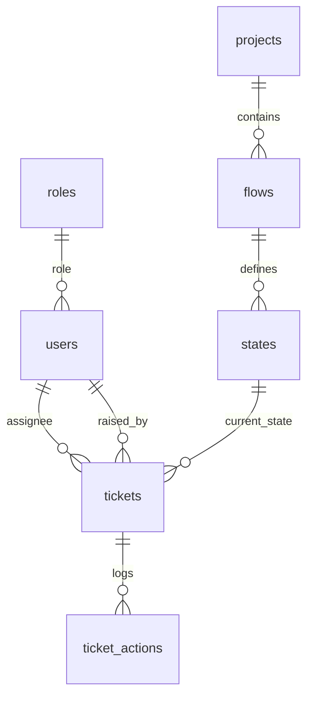

# pView Alert System

pView Alert System is a premium, data-dense web application designed specifically for Network Operations Center (NOC) teams to manage alerts, trigger escalation flows, and handle ticket lifecycles. Built on **CodeIgniter 4** (PHP 8) and styled with sky-blue accents and a dark-mode-first premium layout, it features a robust, extensible workflow engine with live, zoomable Mermaid diagrams, sliding lockout security, precise rate-limiting, and deep SLA/TAT tracking.

---

## 🛠️ Key Technologies & Architecture

* **Backend Framework:** CodeIgniter 4.5.0 (PHP ^8.1 pin, supports PHP 8.0+)
* **Database Engine:** MySQL 8.0 / MariaDB 10.5+ with structured constraints and cascade soft-deletes
* **Frontend Core:** Bootstrap 5, Vanilla CSS (CSS Custom Variables for seamless theme transitions), jQuery 3.7
* **Interactive UI Enhancements:**
  * **Mermaid.js:** Renders zoomable, pannable, and fullscreen-capable workflow node graphs dynamically
  * **jQuery UI 1.13:** Enables smooth drag-and-drop state reordering for workflow designers
  * **DataTables:** Highly-optimized server-side paginated tables to scale with 100k+ tickets effortlessly
  * **Chart.js:** Visualizes real-time and historical KPI trend charts
  * **Select2:** Powerfully manages searchable dropdowns and operator pools
  * **SweetAlert2 & Toastr:** Delivers premium feedback dialogs and toast alerts
* **Mailer Engine:** PHPMailer 6.9 for reliable SMTP/Sendmail notification queuing

---

## 📁 Project Structure

```text
pview_alerts/
│
├── app/                                 # Core Application logic
│   ├── Config/                          # Route, Database, Mail and app configs
│   ├── Controllers/
│   │   ├── BaseController.php           # Core controller loading session & models
│   │   ├── app.php                      # NOC dashboards, CRUD modules, AJAX & REST APIs
│   │   └── user.php                     # Authentication, profiles, security & settings
│   │
│   ├── Helpers/
│   │   ├── alert_helper.php             # Email builders, @mentions, and general helpers
│   │   ├── flow_helper.php              # Dynamically compiles Mermaid diagram markup
│   │   └── security_helper.php          # Lockouts, rate-limiting, and upload sniffers
│   │
│   ├── Models/
│   │   ├── app_model.php                # Core operational queries (tickets, flows, matrix)
│   │   └── user_model.php               # User CRUD, custom roles, and auth states
│   │
│   └── Views/                           # Secure PHP templates and page structures
│
├── docs/                                # Technical specifications & manuals
│   ├── README.md                        # Application overview & instructions (this file)
│   ├── PROJECT_PLAN.md                  # Milestone details & phase breakdowns
│   ├── test_plan.md                     # QA scenario matrix and test cases
│   └── user_documentation.md            # Operator & NOC team lead user guide
│
├── public/                              # Web server root
│   ├── assets/                          # Static assets (fonts, CSS, JS)
│   │   ├── fonts/                       # Local Inter and JetBrains Mono fonts (No CDNs)
│   │   └── vendor/                      # Offline-vendored frontend libraries
│   ├── index.php                        # CI4 Front Controller bootstrap
│   └── .htaccess                        # URL rewriting and file access restrictions
│
├── scripts/                             # Server CLI operational utilities
│   ├── alert_system_schema.sql          # Clean schema dump (17 tables)
│   ├── setup_defaults.php               # System seeding script (wipes and builds baseline)
│   └── migrate_*.sql                    # Cumulative schema migrations
│
├── writable/                            # Cache, logging, and uploaded files (server-writable)
├── composer.json                        # Dependencies, autoload maps & platform locks
├── tat_monitor.php                      # Background cron worker: handles SLA breaches
└── spark                                # CodeIgniter CLI tool
```

---

## 🗄️ Database Structure

The system relies on **17 highly optimized tables** with indexed foreign keys. You can find the database schema inside the [alert_system_schema.sql](file:///c:/xampp8/htdocs/pview_alerts/scripts/alert_system_schema.sql) file.



### Table Matrix

| Table Name | Description | Key Fields / Constraints |
| :--- | :--- | :--- |
| **`users`** | Operator registry. Supports soft deletes to maintain historical ticket relations. | `user_id` (Unique String), `role`, `theme`, `password_changed_at`, `deleted_at` |
| **`roles`** | Custom role dictionary containing privilege settings. | `role_key` (PK), `is_admin_scope` |
| **`module_permissions`**| Access Control Matrix detailing module grants (View, Add, Edit, Delete). | `role`, `module_key` (Unique Composite Index) |
| **`projects`** | Top-level business groups (soft-deletes cascade down). | `id` (PK), `status`, `deleted_at` |
| **`flows`** | Workflows belonging to projects (e.g. NOC Alert Flow, Dev Escalation). | `id` (PK), `project_id`, `deleted_at` |
| **`states`** | Nodes/stages inside a flow. Defines multi-tier SLA settings. | `id` (PK), `flow_id`, `parent_state_id` (Tree branching), `l1_user_ids`...`l4_user_ids` (JSON) |
| **`tickets`** | Dynamic ticket store. Unique formats prevent identifier collisions. | `id` (PK), `alarm_id` (Unique formatted `ALM-YYYYMMDD-XXXXX`), `status`, `current_level` |
| **`ticket_actions`** | Immutable ticket audit trail, comment logs, and uploads ledger. | `ticket_id`, `action_type`, `performed_by`, `attachment_path` |
| **`alert_definitions`** | Monitored threshold templates used to trigger alerts automatically. | `project_id`, `flow_id`, `alert_type`, `notify_user_ids` (JSON) |
| **`escalation_matrix`** | Custom routing rule overrides (SLA override) per flow, state, and tier. | `flow_id`, `state_id`, `level`, `escalate_after` (minutes), `notify_user_ids` (JSON) |
| **`api_keys`** | External systems' authentication tokens. Tied securely to single projects. | `api_key` (Unique Hash), `project_id`, `is_active`, `last_used` |
| **`api_request_log`** | Raw log used to enforce granular rate limiting. | `api_key_id`, `requested_at` (Indexed composite) |
| **`activity_logs`** | Global admin/operator audit log. Captures system state changes. | `user_id`, `module`, `action`, `ip_address`, `meta` |
| **`login_attempts`** | Tracks failed and successful log-ins to prevent brute-force attacks. | `ip`, `login_identifier`, `attempted_at` (Cleaned automatically after 7 days) |
| **`saved_filters`** | Personal, reloadable search configurations for tickets list. | `user_id`, `scope`, `query_params` |
| **`user_notification_settings`**| Individual severity subscription matrix per project and alarm type. | `user_id`, `project_id`, `severity` (Unique Composite) |
| **`alarm_id_sequence`** | Monotonic daily sequences ensuring lock-free transaction-safe IDs. | `day_key` (Unique `YYYYMMDD`), `last_seq` |

---

## ⚙️ Security Infrastructure

The application implements enterprise-tier defensive guards at the application layer:

1. **Sliding Brute-Force Lockout:**
   A sliding window lockout blocks credentials stuffing. If a user accumulates **3 failed attempts within 10 minutes** (customizable in system settings), they are locked out. Lockouts expire naturally based on the oldest attempt, and verification delays occur before password checks to mitigate timing attacks.
2. **Strict API Rate Limiting:**
   Granular limits are checked on each incoming request (`api_rate_per_minute` and `api_rate_per_hour`). Old rate-limiting records are pruned inside a minute cron sweep rather than inline, protecting the telemetry pipeline from database lock contention.
3. **Rigorous File-Upload Hardening:**
   * **Magic Byte Sniffing:** Verifies actual content using PHP's `fileinfo` (magic bytes) to reject executable payloads disguised with friendly extensions (e.g., a `.php` file renamed to `.pdf`).
   * **Double Extension Block:** Splitting original filenames by dot segments allows `upload_filename_is_safe()` to verify all intermediate extensions, preventing bypasses like `payload.php.jpg`.
   * **Absolute Denylist:** Even if an administrator misconfigures the allowed extensions list, a hardcoded core denylist rejects executable/configuration files unconditionally.
4. **Hierarchical RBAC Enforcement:**
   `assignable_role_keys()` checks that an operator can never edit, create, delete, or demote a user whose role is higher than their own, eliminating privilege escalation via direct POST tampering.

---

## 🔄 Workflow Engine & Ticket Lifecycle

pView Alert System supports both flat (linear) and tree (branched) state machine topologies.

```text
              [ Raised (Initial State) ]
                           │
                  (L1 SLA: T1 Minutes)
                           │
                L1 Operator Acknowledges
               ┌───────────┴───────────┐
      Linear Progress         Branched Decision
               │                       │
      [ Investigation ]       ┌────────┴────────┐
               │              ▼                 ▼
               │      [ DB Diagnostic ]  [ Network Diagnostic ]
               │              │                 │
               └──────────────┼─────────────────┘
                              ▼
                      [ Resolved / Closed ]
```

### Ticket SLA Tiers & Escalation Matrix
Every workflow state defines **4 sequential levels of SLA** (L1 to L4):
* Each tier specifies an operator notification pool and a Turn-Around-Time (TAT) in minutes.
* **The Escalation Sweep (`tat_monitor.php`):** Runs every minute in the background. It finds tickets that have been in their current state longer than the allowed TAT.
  * **L1 to L3 Breaches:** The system auto-escalates the ticket to the next tier, logs the audit activity, and email-notifies the operators mapped to the new tier.
  * **L4 Breach:** The ticket is flagged as `escalated` dynamically, raising dashboard priority and notifying administrators to intervene.
  * **Escalation Rules Overrides:** Admins can insert overrides into the `escalation_matrix` table to reroute paths or modify times for specific (flow, state, level) combinations without rebuilding the main workflow.

### Proactive Warnings
When a ticket consumes **80% of its TAT window**, the engine queues an `SLA Warning` notification to the current level's pool, allowing intervention before an escalation occurs.

---

## 🔔 Mentions & Notifications Pipeline

* **Queued Delivery:** To avoid halting the browser/API during slow SMTP handshake threads, all ticket updates write a record to `notification_logs` with a status of `pending`.
* **Draining:** The cron worker (`tat_monitor.php`) drains the queue in optimized batches of size `notification_batch_size` every minute.
* **@Mentions Autocomplete:** Inside ticket timelines, operators can use `@user_id` to mention colleagues.
  * `parse_mentions()` extracts mentioned strings, confirms they match active users, and issues direct email notifications.
  * `highlight_mentions()` escapes the input string and highlights chips safely to prevent XSS.

---

## 💻 Profile & User Customization

* **Theme Manager:** Implements standard **Light** and **Dark** theme palettes toggled with a single click. High-performance styling is executed via CSS variables, and an inline script in `<head>` reads `localStorage` to avoid flash-of-unstyled-content (FOUC).
* **Dashboard Widgets Config:** Operators can customize which KPI cards (`open`, `critical`, `major`, `resolved`) to view, set default trend graph intervals (7, 15, 30 days), and pick their default project view from their personal profiles.
* **Selective Subscriptions:** Users can select exactly which projects and severities they wish to receive notifications for, opting out of noisy telemetry channels easily.

---

## 🚀 Installation & Setup

### Prerequisites

1. **Web Server:** Apache 2.4+ (with `mod_rewrite` enabled) or Nginx
2. **Database:** MySQL 8.0+ or MariaDB 10.5+
3. **Runtime:** PHP 8.1.0+ (requires `php-curl`, `php-mysql`, `php-intl`, `php-mbstring`, `php-fileinfo` extensions)
4. **Package Manager:** Composer

### Local Setup (XAMPP / Development environment)

1. **Clone & Install Dependencies:**
   Clone the repository to your root web directory (e.g. `C:\xampp8\htdocs\pview_alerts\`) and install dependencies:
   ```bash
   composer install
   ```

2. **Configure Environment:**
   Copy the default template `env` to `.env`:
   ```bash
   cp env .env
   ```
   Open `.env` and set your local path and database details:
   ```env
   CI_ENVIRONMENT = development
   app.baseURL    = 'http://localhost/pview_alerts/'

   database.default.hostname = 127.0.0.1
   database.default.database = pview_alerts
   database.default.username = root
   database.default.password =
   database.default.DBDriver = MySQLi
   ```

3. **Initialize Database:**
   Create the database and import the structured baseline schema:
   ```bash
   mysql -u root -p -e "CREATE DATABASE IF NOT EXISTS pview_alerts CHARACTER SET utf8mb4 COLLATE utf8mb4_general_ci;"
   mysql -u root -p pview_alerts < scripts/alert_system_schema.sql
   ```

4. **Seed System Defaults:**
   Execute the baseline setup script from the project root. This will wipe any operational tables and seed the core `super_admin` role, modules, default settings, and create the default admin account:
   ```bash
   php scripts/setup_defaults.php
   ```
   * **Default Admin Credentials:** User ID: **`admin`** | Password: **`Demo@1234`**

5. **Configure Apache VirtualHost:**
   Ensure `mod_rewrite` is enabled. The application contains a root-level `.htaccess` that safely redirects requests internally to the `public/` folder, allowing URLs to look clean without showing `/public/` in the browser bar.

---

## 🔧 Deployment Process (Production)

Follow this structured checklist to deploy the application to a production Linux/UNIX host:

1. **Server Requirements:**
   * Linux server (Ubuntu 22.04 LTS / RHEL 9 recommended)
   * Apache 2.4 with `mod_rewrite` enabled
   * PHP 8.1+ with OPcache, Mbstring, Intl, Curl, Fileinfo and MySQLi extensions
   * Let's Encrypt SSL configuration

2. **Clone & Configure Production Settings:**
   * Clone the repo to `/var/www/pview_alerts`.
   * Run production Composer install:
     ```bash
     composer install --no-dev --optimize-autoloader
     ```
   * Setup production `.env`:
     ```env
     CI_ENVIRONMENT = production
     app.baseURL    = 'https://yourdomain.com/'
     # Set secure production DB credentials and strong random passwords
     ```

3. **Apache Vhost Setup:**
   Document root should point to `/var/www/pview_alerts`. The root-level `.htaccess` will manage secure redirections into the `public/` directory seamlessly.

4. **Background Task Scheduling (Cron):**
   Setup the system cron scheduler to trigger the escalation engine and email dispatcher **every minute**:
   ```bash
   * * * * * php /var/www/pview_alerts/tat_monitor.php >> /var/log/pview/tat.log 2>&1
   ```

5. **Production Backups:**
   Integrate [backup.sh](file:///c:/xampp8/htdocs/pview_alerts/docs/backup.sh) to run daily at off-peak hours (e.g., 2:30 AM). Make sure to configure the output target folder securely:
   ```bash
   30 2 * * * /var/www/pview_alerts/docs/backup.sh >> /var/log/pview-backup.log 2>&1
   ```

---

## 🔌 Integration REST API

External monitoring tools (e.g., Prometheus, Zabbix, Dynatrace) can automatically ingest alerts into pView. Authenticaton is handled via an `X-API-KEY` HTTP header.

### 1. Ingest/Raise Alert
* **Endpoint:** `POST /api/raise`
* **Headers:**
  ```http
  X-API-KEY: your_masked_api_key_hash
  Content-Type: application/json
  ```
* **Payload:**
  ```json
  {
    "project_id": 1,
    "flow_id": 2,
    "title": "Database connection pool exhausted",
    "description": "DB connection count exceeded 95% threshold on DB-NODE-01.",
    "alert_type": "critical",
    "priority": "urgent"
  }
  ```
* **Response (Success):**
  ```json
  {
    "status": "success",
    "message": "Ticket created successfully.",
    "data": {
      "alarm_id": "ALM-20260529-00001",
      "ticket_id": 14
    }
  }
  ```

### 2. Update Ticket
* **Endpoint:** `POST /api/alert/ALM-20260529-00001/update`
* **Headers:** `X-API-KEY: your_key`
* **Payload:**
  ```json
  {
    "action": "resolved",
    "comment": "Connection pool cleared by restarting service thread."
  }
  ```
* **Response (Success):**
  ```json
  {
    "status": "success",
    "message": "Ticket updated successfully."
  }
  ```

### Rate Limiting Headers
Every API response returns standard rate-limiting metadata headers:
```http
X-RateLimit-Limit-Min: 60
X-RateLimit-Limit-Hour: 1000
X-RateLimit-Remaining-Min: 58
X-RateLimit-Remaining-Hour: 994
```
When limits are breached, the API returns `HTTP 429 Too Many Requests` with a descriptive JSON error.

---

## 🧑‍💻 Contributing & Handover Notes

* **Flat Controllers:** All standard page routing and operational actions are located in [app.php](file:///c:/xampp8/htdocs/pview_alerts/app/Controllers/app.php). Auth guards and user CRUD are located in [user.php](file:///c:/xampp8/htdocs/pview_alerts/app/Controllers/user.php).
* **Single Models:** `App_model` encapsulates all workflow and ticket state queries; keep new DB operations within this model to maintain structural clean layouts.
* **Offline-Ready UI:** No scripts, fonts, or styling relies on CDNs. If deploying inside closed intranet systems, the web client will load perfectly without external internet access.
* **Writable Folders:** Ensure `/writable` is owned by the Apache user (`www-data` or `apache`) and has `chmod 775` permissions applied recursively on Linux.
