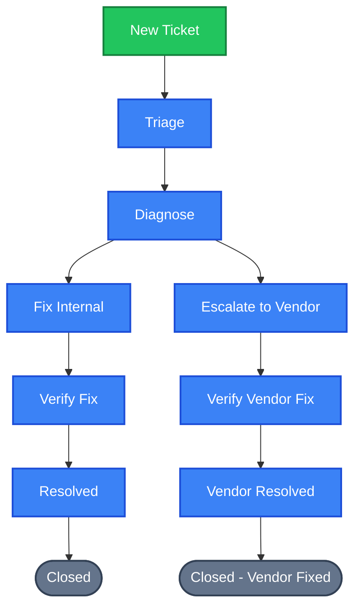
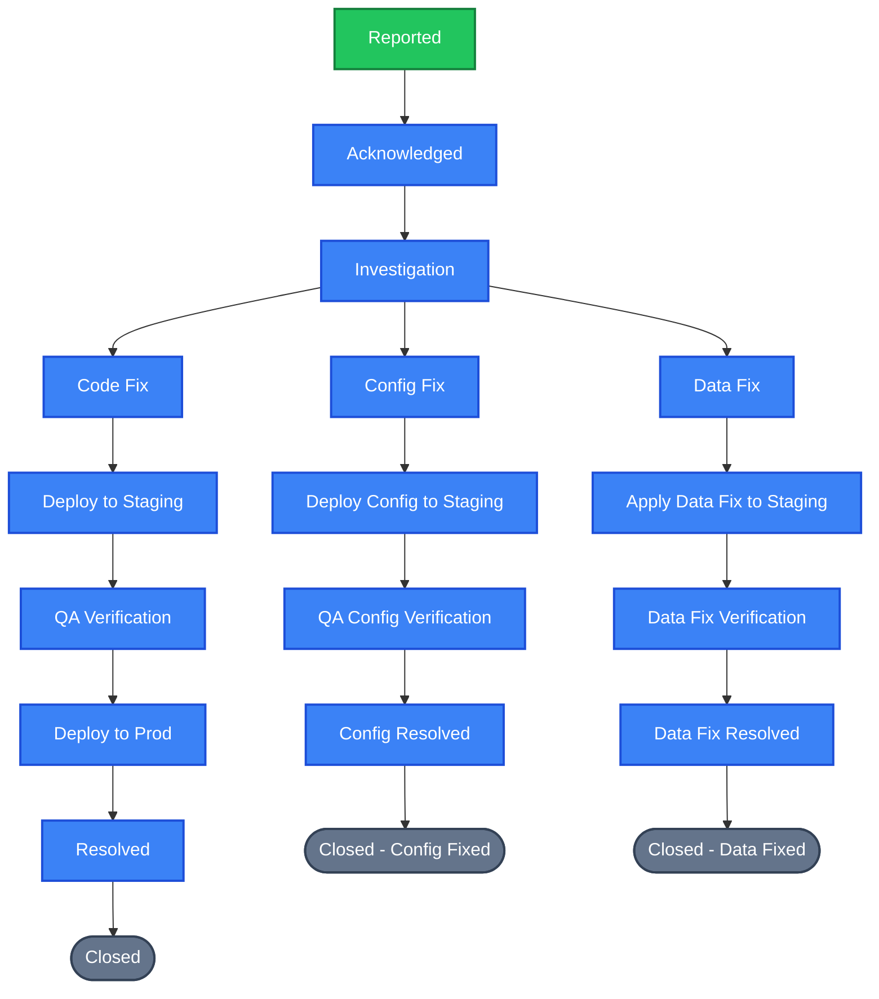
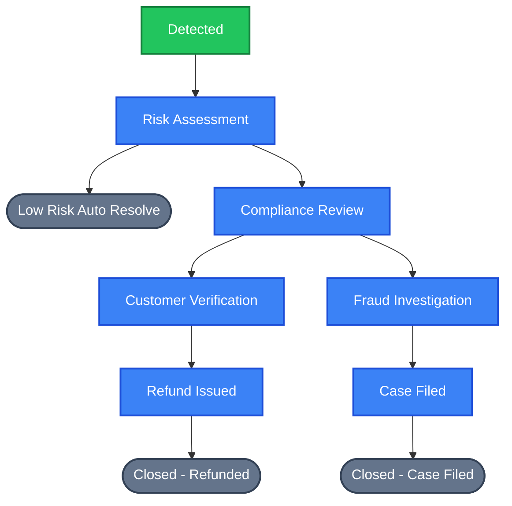

# pView Alert System: End-to-End User Level Documentation & Operator Guide

Welcome to the **pView Alert System** User Level Documentation. This guide is written by developers for operators, administrators, and trainers to provide a comprehensive, step-by-step breakdown of how the platform functions in everyday operations. 

Whether you are configuring system-wide routing rules or responding to critical infrastructure alerts under tight SLAs, this manual outlines everything you need to know.

---

## Table of Contents
1. [Platform Overview & Core Terminology](#1-platform-overview--core-terminology)
2. [User Role Matrix & Permissions](#2-user-role-matrix--permissions)
3. [The Operator Lifecycle: Step-by-Step Walkthrough](#3-the-operator-lifecycle-step-by-step-walkthrough)
   - [Authentication & Dashboard Overview](#authentication--dashboard-overview)
   - [Project & Workflow configuration (Admin/Super Admin)](#project--workflow-configuration-adminsuper-admin)
   - [State Management & SLA Setup](#state-management--sla-setup)
   - [Escalation Matrix Rules](#escalation-matrix-rules)
   - [API Key Ingestion](#api-key-ingestion)
   - [Managing Tickets (Manual & Ingested)](#managing-tickets-manual--ingested)
   - [Interactive Ticket Action Panel](#interactive-ticket-action-panel)
4. [Branching Workflow Logic & Tree Topology](#4-branching-workflow-logic--tree-topology)
5. [End-to-End Practical Example: Real-World Incident Simulation](#5-end-to-end-practical-example-real-world-incident-simulation)
6. [UI Reference & Screenshot Guide](#6-ui-reference--screenshot-guide)

---

## 1. Platform Overview & Core Terminology

The **pView Alert System** is an enterprise-grade incident management and telemetry aggregation platform designed to operate inside secure, high-integrity environments (such as private corporate VPNs). It functions as the central nervous system for monitoring tools, system engineers, and security teams.

### Core System Vocabulary
* **Project**: A distinct operational domain or division within your organization (e.g., *Production Infrastructure*, *Payment Gateway*). All workflows, alert definitions, tickets, and API keys are scoped to a Project.
* **Flow**: A structured business process or workflow defined within a project. A project can house multiple flows depending on the incident type.
* **State**: A single step or stage within a Flow (e.g., *New Ticket*, *Triage*, *Investigation*, *Resolved*). States can be linear or branch out like a tree.
* **SLA Level (L1 - L4)**: Clearance tiers representing the complexity and urgency of a ticket. As a ticket ages without attention, it escalates through L1 to L2, L3, and L4.
* **Turn-Around-Time (TAT)**: The time limit (in minutes) assigned to a state at a specific SLA level. If an assignee does not resolve or move the ticket before the TAT expires, it triggers an escalation.
* **Escalation Matrix**: A configuration table specifying how tickets escalate from one SLA tier to another, which operators are notified, and what alert severity is raised.
* **API Key**: A cryptographically secure token used by external telemetry collectors (e.g., Prometheus, Grafana, custom cron scripts) to automatically ingest alerts as tickets.

---

## 2. User Role Matrix & Permissions

To maintain strict operational boundaries and clean separations of concern, the system enforces three primary roles. The sidebar menus, interface buttons, and API routes dynamically adjust based on the logged-in operator's role.

### The Role Matrix at a Glance

| Module / Feature | Super Admin | Admin | User Role (Operator) |
| :--- | :---: | :---: | :---: |
| **System Settings & Rules** | Yes | No | No |
| **User Registries & Auditing** | Yes | No | No |
| **Project Creation & Configuration** | Yes | Yes | No |
| **Flow & State Config (Workflow Editor)** | Yes | Yes | No |
| **Escalation Matrix Config** | Yes | Yes | No |
| **Alert Definitions & API Key Gen** | Yes | Yes | No |
| **Telemetry Ingestion APIs** | Read/Write | Read/Write | Read-only |
| **Manual Ticket Creation** | Yes | Yes | Yes |
| **Ticket Assignment & Transitions**| Yes | Yes | Yes (Restricted to Pool) |
| **Global Ticket Visibility** | Yes | Yes | No (Scoped to Assigned/Involved)|

### Role-Specific Behaviors

#### A. Super Admin
* **Purpose**: Oversees system configuration, security posture, and personnel.
* **Functionality**: Accesses the "System Settings" panel and "Module Control Panel" under the sidebar Configuration menu.
* **User Actions**: Can create/deactivate users, change global password expiration thresholds, alter global TAT default behaviors, reset user accounts, and override permissions.
* **Expected Behavior**: Full read/write access to every database row. The system-wide metrics dashboard reflects global numbers.

#### B. Admin
* **Purpose**: Coordinates specific operational divisions and maintains workflow definitions.
* **Functionality**: Accesses the "Configuration" menu to manage Projects, Flows, States, Escalation Matrices, and Alert Definitions. Cannot see or modify users or system settings.
* **User Actions**: Creates new projects, defines parent-child workflow states, registers API keys for third-party systems, and edits the escalation alert severity rules.
* **Expected Behavior**: Dynamic configuration changes automatically update the user interface immediately. Admins can see all tickets globally.

#### C. User Roles (Operators)
Operators are mapped into specific personas representing functional tiers. They focus exclusively on ticket resolution:
* **NOC L1 (Tier 1 Support)**: First responders. Handled through simple triage, acknowledging alerts, and routing to specialized pools.
* **NOC L2 (Tier 2 Support)**: Intermediate support. Handles detailed diagnostic state transitions and configuration modifications.
* **Team Lead (Escalation Authority)**: Coordinates shifts. Authorizes critical transitions, handles L3 escalations, and approves resolutions.
* **Viewer**: Read-only stakeholder (e.g., a customer relations manager). Can monitor progress but is blocked from writing comments or changing states.

---

## 3. The Operator Lifecycle: Step-by-Step Walkthrough

### Authentication & Dashboard Overview

#### Purpose
Safely log in operators, establish secure sessions, and present a real-time, consolidated operational status.

```
+-------------------------------------------------------------+
|                     pView Alert System                      |
|                                                             |
|   [ Username ]  [**********]           [ Log In ]           |
|                                                             |
+-------------------------------------------------------------+
```

#### Functionality
* The login gate utilizes rate-limiting to prevent brute-force dictionary attacks.
* On successful authentication, the operator is redirected to the Dashboard.

#### Dashboard Layout & Interactive Elements
1. **Status Counters**: Real-time display of tickets categorized as:
   - `Open` (Grey): Newly raised, unassigned.
   - `In Progress` (Blue): Actively investigated by an operator.
   - `Escalated` (Red): TAT breached, requires urgent attention.
   - `Resolved` (Green): Solution applied, waiting for supervisor validation.
   - `Closed` (Dark Grey): Verified and completed.
2. **Active Alert Distribution**: Pie/Bar chart representing incoming alert volume by severity (`Info`, `Major`, `Critical`).
3. **15-Day Ingestion Trend**: Interactive line graph plotting daily ticket generation trends.
4. **Actionable Tickets Queue**: Scoped strictly to the logged-in operator. Admins see all tickets, while L1 operators see only tickets matching their level in the current state pools.
5. **Theme Toggle**: Located at the top bar. Instantly switches between a premium Dark Mode (reduces eye strain during night shifts) and Light Mode. Saves preference locally in the browser.

---

### Project & Workflow Configuration (Admin/Super Admin)

#### Purpose
Represent real-world business units and dictate how work flows through them.

#### User Actions & UI Workflow
1. Navigate to **Configuration -> Projects** in the sidebar.
2. Click **Create Project**. Provide a unique name and detailed description.

> [!IMPORTANT]
> **Soft-Delete Integrity (Cascading Deletes):**
> When a project is decommissioned, clicking "Delete" triggers a secure, cascading soft-delete. The project's active status flips to `inactive`, its child `flows` are immediately deactivated, and all associated `alert_definitions` and `api_keys` are marked offline. This prevents external systems from generating phantom tickets under archived projects.

```
   +-------------------+
   |   Soft-Delete     |
   |   Project "A"     |
   +---------+---------+
             |
             v
   +-----------------------+
   | Deactivate all Flows  |
   +---------+-------------+
             |
             v
   +-------------------------------+
   | Deactivate Alert Definitions  |
   +---------+---------------------+
             |
             v
   +-----------------------+
   | Disable API Keys      |
   +-----------------------+
```

3. Navigate to **Configuration -> Flows**.
4. Click **Create Flow**, select the parent Project, and give the flow a name (e.g., *Customer Issue Resolution*).

---

### State Management & SLA Setup

#### Purpose
Define individual stages within a workflow, specify which operator pools handle each stage, and set resolution timers (TAT).

#### Functionality
A workflow can be flat (linear) or branching. Each state has:
* **Parent State Link**: Tells the system where tickets come from.
* **Initial State Flag**: Marks this state as the entry point for new tickets (only 1 per flow).
* **Final State Flag**: Marks this state as a terminal node.
* **Level Pools (L1 - L4)**: A list of specific user IDs authorized to be assigned to tickets in this state.
* **Level TAT (in minutes)**: The SLA duration allowed for this state at each level.

#### Expected Behavior
When editing states, the system performs validation:
* A state **cannot** be its own parent.
* Loop prevention algorithms check the entire chain recursively. If a parent link change would create a cyclic state loop, the change is instantly rejected to avoid system crashes.

---

### Escalation Matrix Rules

#### Purpose
Establish automatic routing protocols when operators breach their SLA time limits.

#### User Actions & Expected Behavior
1. Navigate to **Configuration -> Escalation Matrix**.
2. Select a target **Flow** and **State**, then select the **SLA Level** to monitor.
3. Define `Escalate After (Minutes)` (e.g., 60 minutes).
4. Specify the **Notify User IDs** to alert via email/dashboard notices, and set the **Severity Escalation** (`Info`, `Major`, `Critical`).

* **Expected Operational Flow**: The background `tat_monitor.php` script runs on a periodic cron cycle. If a ticket in the *Triage* state sits unassigned or unresolved beyond the configured TAT, the monitor:
  1. Increments the ticket's `current_level` (e.g., L1 $\rightarrow$ L2).
  2. Updates the ticket status to `escalated`.
  3. Enqueues styled email notifications to the designated L2 operators.
  4. Records the escalation in the ticket’s historical timeline.

---

### API Key Ingestion

#### Purpose
Connect external telemetry, logging, and monitoring systems directly to pView.

#### User Actions & Ingest Behavior
1. Navigate to **Configuration -> API Keys**.
2. Select a target **Project** and click **Generate Key**.
3. Copy the random token immediately (it is encrypted and hidden after generation).
4. External systems must supply this token in HTTP requests via the header `X-API-KEY`.

* **Expected Behavior**: When telemetry is received via `/api/raise`, the system decodes the API key, ensures the parent project is active and NOT soft-deleted, maps the alert to the configured Flow, identifies the Initial State, generates a unique, sequential Alarm ID (e.g., `ALM-20260526-00001`), and raises a ticket automatically.

---

### Managing Tickets (Manual & Ingested)

#### Purpose
Provide operators with high-fidelity, high-performance filters to locate, search, and manage active incident queues.

#### User Actions & UI Controls
* **My Tickets**: Displays tickets where the operator is the assignee, the original reporter, or part of the active SLA level pool for the ticket's current state.
* **All Tickets**: Full grid overview (restricted to Admin/Super Admin).
* **Advanced DataTables**:
  - **Dynamic Pagination**: Adjustable page sizes (10, 25, 50, 100).
  - **Server-Side Sort & Search**: Clicking table columns triggers key-indexed queries on the server, loading millions of records instantly. Global search filters across title, description, and Alarm ID.
  - **Column Filters**: Scopes tickets by Project, Flow, Alert Type, or Priority.
  - **Saved Filters**: Operators can save custom search parameters (e.g., *"My Open Criticals"*) to quickly pull up relevant queues in one click.

---

### Interactive Ticket Action Panel

The ticket detail page is the primary operational view. Operators can perform actions via a real-time command panel.

```
+-------------------------------------------------------------+
| [ALM-20260526-00001] CPU Usage High (92%)                    |
| State: Triage [ L1 ]  |  Assignee: Aarav Patel              |
+-------------------------------------------------------------+
|                                                             |
|   [ Timeline & History ]             [ Action Panel ]       |
|                                                             |
|   - 10:00 Auto-Ingested              ( ) Assign to L1       |
|   - 10:05 Assigned to Aarav          ( ) Move State         |
|   - 10:10 Comment: "Checking..."     ( ) Resolve Ticket     |
|                                      ( ) Close Ticket       |
|                                                             |
+-------------------------------------------------------------+
```

#### 1. Assign Ticket
* **Action**: Choose a user from the dropdown and click "Assign".
* **Rule**: The dropdown is dynamically restricted to active operators registered in the level pool for the ticket’s current state. Operators cannot assign tickets to unauthorized users. On assignment, the ticket status flips to `in_progress`.

#### 2. Move State (Workflow Progress)
* **Action**: Advance the ticket to the next phase of the workflow.
* **Rule**: The system reads the flow configuration. 
  - If there is only **one** child state, a simple "Advance State" button appears.
  - If there are **multiple branches** (e.g., a decision point), a dropdown forces the operator to select the target branch.
  - If the ticket is in a **final state** or **terminal status** (Resolved/Closed), state movement is frozen.

#### 3. Add Comments & Attachments
* **Action**: Type logs or upload troubleshooting attachments.
* **Rule**: Uploads undergo automatic magic-byte file signature validation to prevent malicious uploads (e.g., renaming `evil.php` to `evil.jpg` is rejected). Files are sanitized, assigned random UUID hashes, and hosted securely.

#### 4. Resolve & Close
* **Action**: Mark a ticket resolved once fixed.
* **Rule**: A resolved ticket locks down. To archive it, an administrator must review the timeline and click **Close Ticket**, freezing all further edits.

---

## 4. Branching Workflow Logic & Tree Topology

The pView Alert System enforces a **strict parent-child tree structure** for workflows. Under the database schema, each state contains a `parent_state_id` column. A state can have only *one* parent, but a single state can have *multiple children*, enabling branching logic.

### Why Tree Topology Matters
Older ticket trackers used simple linear queues. This forced irrelevant steps onto specialized issues. Branching workflows allow teams to split tickets down specific pathways depending on the diagnosis, optimizing resolution times.

### Branched Flow Visualizations & Logic Maps

#### Flow 1: Incident Response Flow
Designed for infrastructure support. After initial triage, the ticket splits based on internal capacity.



* **The Logic**: If an engineer diagnoses the issue as a third-party software bug, they transition the ticket to `Escalate to Vendor`. Instead of dead-ending, the ticket proceeds along its own validation and resolution path, terminating cleanly in `Closed - Vendor Fixed`.

---

#### Flow 2: Customer Issue Resolution Workflow
Designed for application support. During investigation, issues are grouped into three distinct categories, each with custom deployment pipelines.



---

#### Flow 3: Payment Investigation Workflow
Highly structured risk assessment flow with separate compliance-driven terminal states.



---

## 5. End-to-End Practical Example: Real-World Incident Simulation

Let’s trace a real-world infrastructure event from telemetry alert to ticket closure.

### The Scenario: Database Replication Lag Spike
The primary database replica is experiencing lag due to a heavy batch analytics query. 

```
                                      [ TAT BREACHED ]
                                              |
                                              v
   Ingestion           L1 Triage          L2 Escalation          Resolution
+-------------+     +-------------+     +--------------+      +--------------+
| DB Lag > 60s| --> | Acknowledge | --> | Priya Sharma | ---> |  Kill Query  |
| (API Key)   |     | (Aarav L1)  |     |   (NOC L2)   |      |  Verify Lag  |
+-------------+     +-------------+     +--------------+      +--------------+
```

#### Step 1: Ingestion
1. A cron monitor detects replica lag is at **95 seconds** (threshold is 60s).
2. The monitor issues a secure POST request to `/api/raise` containing the API key in the header and payload:
   ```json
   {
     "alert_name": "DB Replication Lag",
     "severity": "critical",
     "description": "Replica lag has exceeded 60s threshold."
   }
   ```
3. pView validates the key, maps it to **Incident Response Flow**, creates ticket **ALM-20260526-00001** in state **New Ticket**, and triggers an enqueued alert.

#### Step 2: First Response (NOC L1)
1. Operator **Aarav Patel** logs in, checks the Dashboard, and sees a new `Critical` alert.
2. Aarav opens the ticket, clicks **Assign**, and chooses his name. The ticket status flips to `in_progress`.
3. Aarav reviews the details, runs diagnostic commands on the database console, and moves the state to **Triage**. 
4. After verifying the replication thread is blocked on a massive update, Aarav transitions the ticket to **Diagnose** to request specialist intervention.

#### Step 3: SLA Breach & Auto-Escalation
1. The specialist pool (NOC L2) is busy with a network failover. The ticket sits in **Diagnose** for 120 minutes.
2. The background cron runner (`tat_monitor.php`) detects a TAT breach (limit is 120m for Diagnose).
3. The monitor automatically changes the ticket status to `escalated`, moves its level to L2, and emails the L2 notification pool.

#### Step 4: Specialist Intervention (NOC L2)
1. Senior Operator **Priya Sharma** sees the red escalation badge on her dashboard.
2. She assigns the ticket to herself and reviews the diagnostic logs.
3. Priya identifies the rogue analytics query, kills the session, and caps batch worker threads.
4. She comments: *"Killed session #88412; lag draining naturally."*
5. Priya moves the ticket state to **Fix Internal**, then **Verify Fix** as replica lag drops back to 0.

#### Step 5: Resolution & Archive
1. Once lag is stable for 15 minutes, Priya clicks **Resolve Ticket**. The ticket status flips to `resolved`.
2. The Team Lead reviews the timeline and verified fix logs, then clicks **Close Ticket**. The ticket status is set to `closed`, locking the record as a secure, immutable historical log.

---

## 6. UI Reference & Screenshot Guide

To prepare this documentation for client slide decks or training manuals, insert screenshots at the following designated placeholders:

### Screenshot Placeholder 1: The Login Portal
* **Visual Location**: Browser main page, centered clean card with credentials input.
* **Trainer Tip**: Highlight the secure login fields and the rate-limiter check indicator.

### Screenshot Placeholder 2: Operator Command Dashboard
* **Visual Location**: Dashboard homepage.
* **Trainer Tip**: Capture the theme toggle, the colorful state metric cards, the severity distribution pie chart, and the interactive trend graph.

### Screenshot Placeholder 3: Workflow State Designer (Admin Panel)
* **Visual Location**: **Configuration -> Flows -> States**.
* **Trainer Tip**: Capture the tree structure layout, the parent state dropdown fields, the level assignee check-boxes, and the TAT input fields.

### Screenshot Placeholder 4: Ticket Progress Diagram (Mermaid View)
* **Visual Location**: Inside the ticket details page.
* **Trainer Tip**: Point out the dynamic color coding. Past states are green, current state is highlighted in bold blue, and pending steps are styled in light grey. This allows executives to see exact status at a glance.

---

*Document Version: 2.1*  
*Author: Core Development Team*  
*Environment Scope: Private VPN Telemetry Ingestion Network*
